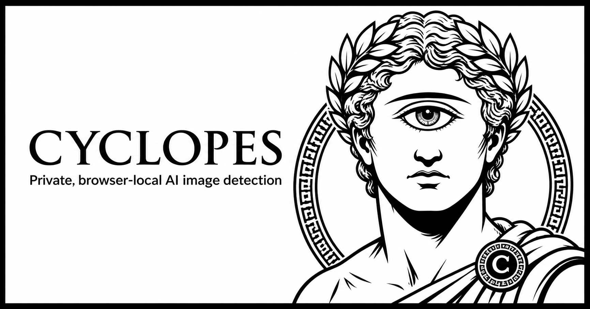
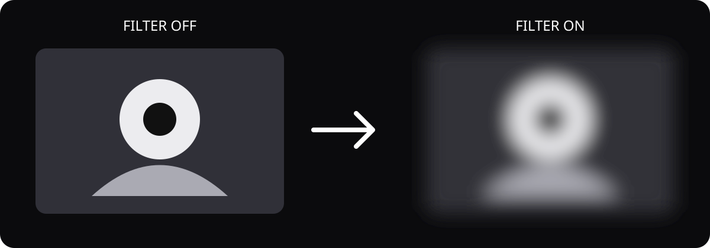

#  Cyclopes

> Private, browser-local AI image detection. No uploads, accounts, or remote inference.

**93.68% AI precision · 94.83% balanced accuracy · fixed 65% operating point**



## Demo



Cyclopes inspects eligible images in the active tab, displays a local confidence badge, and can optionally blur likely AI content. The model sees pixels—not filenames, prompts, tags, or embedded metadata.

> A video demo and public store buttons will be added after store review.

<details>
<summary><strong>Table of contents</strong></summary>

- [Install and launch](#install-and-launch)
- [Metrics](#metrics)
- [How it works](#how-it-works)
- [Development](#development)
- [Research and reproducibility](#research-and-reproducibility)

</details>

<details id="install-and-launch">
<summary><strong>Install and launch</strong></summary>

### Chromium browsers

1. Download the latest package from [GitHub Releases](https://github.com/T-Damer/cyclopes/releases).
2. Extract it.
3. Open `chrome://extensions` or `edge://extensions`.
4. Enable **Developer mode**, choose **Load unpacked**, and select the extracted directory containing `manifest.json`.

The Chrome, Edge, and Firefox store listings are currently under review.

### What you can control

- global and per-site detection;
- confidence threshold and minimum source size;
- CSS background-image detection;
- optional AI-image blur;
- smart badge placement and theme;
- browser-local AI/non-AI correction reports.

All report previews and settings remain in browser storage. See the [privacy policy](docs/PRIVACY.md).

</details>

<details id="metrics">
<summary><strong>Metrics</strong></summary>

Results use the frozen v0.2 model and the fixed `0.65` decision threshold.

| Held-out evaluation set | Images | Balanced accuracy | AI precision | AI recall | Real specificity |
| --- | ---: | ---: | ---: | ---: | ---: |
| AI Detector Arena v0.1 | 2,031 | **94.83%** | **93.68%** | 96.17% | 93.48% |
| Arena, deterministic web degradation | 2,031 | **91.67%** | 87.53% | 97.25% | 86.08% |
| Held-out training sources, web degradation | 2,798 | **95.35%** | 96.11% | 93.82% | 96.87% |

These are public proxy evaluations, not the private POIDH score. The acceptance criteria, split rules, and limitations are documented in the [AI contract](AI-SPEC.md), [evaluation protocol](docs/EVALUATION.md), and [training record](docs/TRAINING-PLAN.md).

</details>

<details id="how-it-works">
<summary><strong>How it works</strong></summary>

Cyclopes v0.2 is a single browser-local ONNX model: a frozen forensic ViT-S encoder with project-specific multi-layer and scale-consistency residual heads. Clean and recompressed views are paired during training so the detector is less dependent on one resolution or codec.

The extension:

1. watches eligible images in the visible, active tab;
2. skips tiny, hidden, video-poster, or heavily occluded content;
3. waits for moving layouts to settle before placing a badge;
4. preprocesses and scores pixels through the packaged ONNX runtime—WebGPU/WASM on Chromium and WebGL in the Firefox build;
5. anchors the badge using DOM hit-testing while avoiding visible page controls when possible.

Dataset provenance, licensing, deduplication, and split policy are recorded in [DATASETS.md](DATASETS.md). Browser behavior and the model contract are frozen in [AI-SPEC.md](AI-SPEC.md).

</details>

<details id="development">
<summary><strong>Development</strong></summary>

### Build and test

```bash
npm ci
npm test
```

Build browser-specific unpacked extensions:

```bash
npm run build          # dist/ — Chrome and Edge
npm run build:firefox  # dist-firefox/ — Firefox
```

Load `dist/` from the Chromium extensions page, or load `dist-firefox/manifest.json` temporarily from Firefox's `about:debugging` page.

Training and evaluation require Python 3.11–3.13:

```bash
python -m venv .venv
.venv/bin/pip install -r requirements-train.txt
.venv/bin/python -m pytest -q
```

Put private regression images in `personal-tests/`; its contents are excluded from Git. Detailed training, calibration, export, parity, and browser-QA commands live in [docs/agents.md](docs/agents.md).

</details>

<details id="research-and-reproducibility">
<summary><strong>Research and reproducibility</strong></summary>

Cyclopes started with a simpler detector, then tested scale-paired adaptation, harder real-image negatives, browser degradation, and routed expert corrections. The v0.3 expert candidate improved selected slices but failed the release gates, so v0.2 remained the release model instead of replacing it with a favourable-looking experiment.

- [AI-SPEC.md](AI-SPEC.md) — model, threshold, data, and browser contracts
- [DATASETS.md](DATASETS.md) — dataset sources, licensing, and provenance
- [docs/EVALUATION.md](docs/EVALUATION.md) — held-out evaluation design and release gates
- [docs/TRAINING-PLAN.md](docs/TRAINING-PLAN.md) — accepted v0.2 run and rejected v0.3 post-mortem
- [docs/agents.md](docs/agents.md) — reproducible commands and contributor workflow
- [THIRD_PARTY_NOTICES.md](THIRD_PARTY_NOTICES.md) — bundled model/runtime notices

</details>

MIT licensed. Built for [POIDH bounty #323](https://poidh.xyz/arbitrum/bounty/323).
