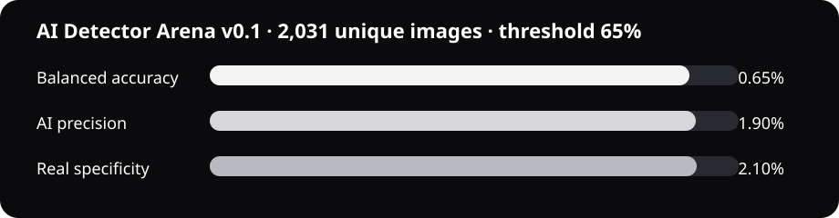

<p align="center"></p>

# Cyclopes

## Demo


Browser-local AI image filtering. One button, no uploads: images scoring at least **65% AI** are blurred.

**78.02% AI precision · 75.49% balanced accuracy** on AI Detector Arena v0.1.



## Contents

- [Install](#install)
- [Approach](#approach)
- [Metrics](#metrics)
- [Development](#development)

## Install

```bash
npm ci
npm run build
```

Open `chrome://extensions`, enable Developer mode, choose **Load unpacked**, and select `dist/`. Reload already-open pages once, then click the Cyclopes icon to toggle **Filter: ON/OFF**.

## Approach

Two complementary local CNNs: our FastViT-T8 learns RGB and high-pass forensic residuals; an Apache-2.0 ConvNeXt adds a conservative real-image signal. Both ONNX models run through WebGPU with a WASM fallback. No metadata or runtime model download is used.

## Metrics

| External set | Images | Balanced accuracy | AI precision | AI recall | Real specificity |
| --- | ---: | ---: | ---: | ---: | ---: |
| AI Detector Arena v0.1 | 2,031 | **75.49%** | **78.02%** | 71.12% | 79.86% |
| Synthbuster + RAISE-1k | 4,990 | **75.19%** | 94.52% | 65.67% | 84.71% |

The operating point is fixed at 65%. Detection remains probabilistic and generator-dependent.

## Development

```bash
python -m pytest -q
npm test
```

Full data, training, export, and evaluation instructions: [`docs/agents.md`](docs/agents.md). Dataset provenance: [`DATASETS.md`](DATASETS.md). Third-party licenses: [`THIRD_PARTY_NOTICES.md`](THIRD_PARTY_NOTICES.md).

MIT licensed. Built for [POIDH bounty #323](https://poidh.xyz/arbitrum/bounty/323).
